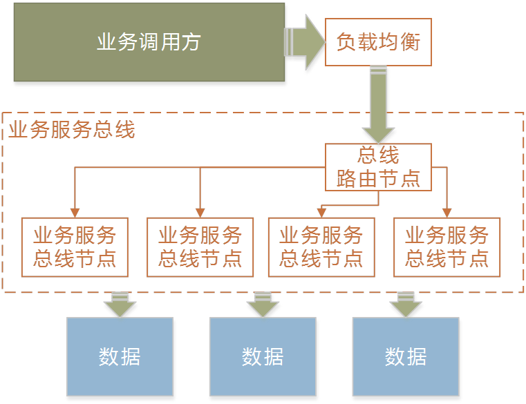
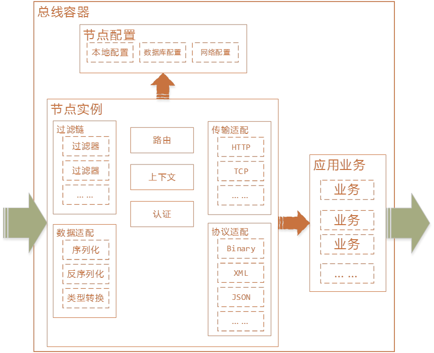
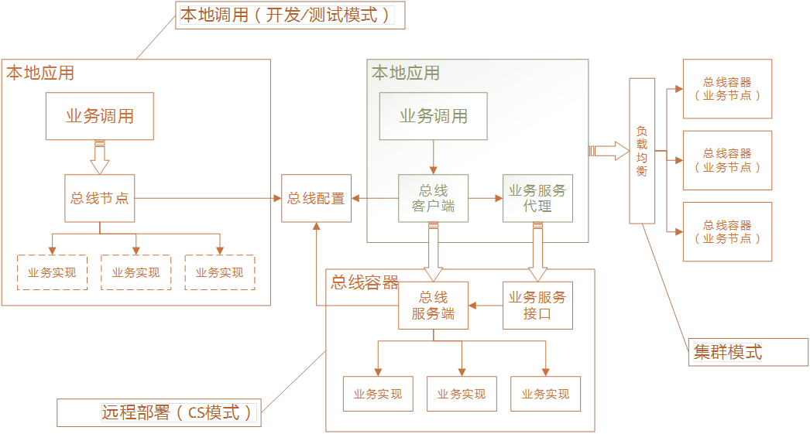
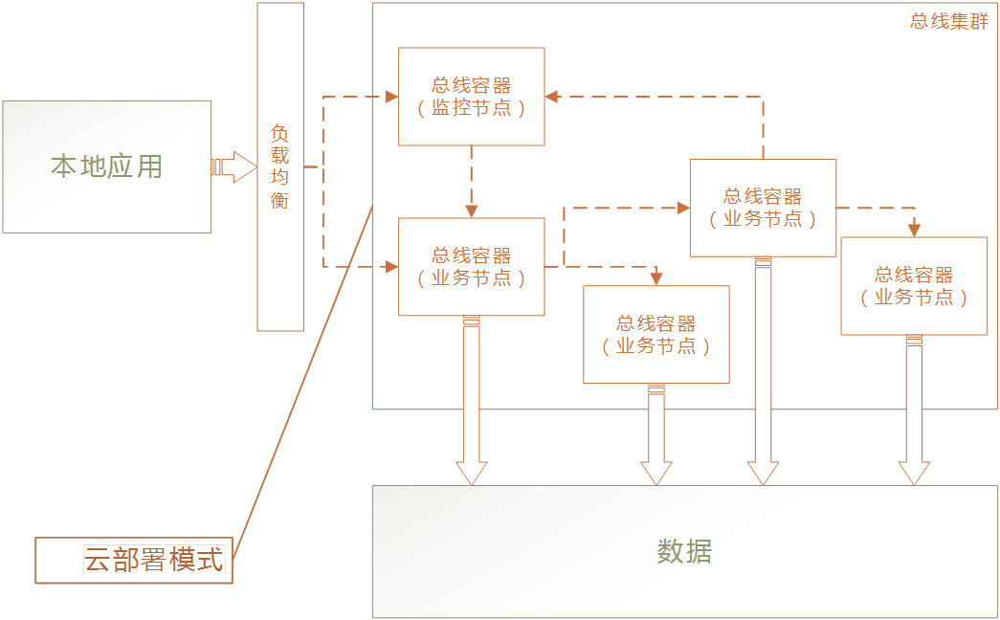

# ALBus架构设计

## 概述

### ALBus定义

ALBus项目是一个基于标准化协议和框架的服务接口总线产品。

它为业务逻辑实现提供了基于多种通讯和数据协议的业务服务接口调用解决方案，拥有以下优点：

- 灵活的部署模式
- 敏捷高效的业务扩展、变更与伸缩
- 便捷丰富的前后端（业务使用者和业务提供者）开发手段
- 可配置、可插拔的系统功能扩展

从而能良好的适配各种业务场景、业务量和业务模式。

### ALBus概念

#### 接口

业务接口的缩写。在ALBus中一般“接口”和“业务”是同义词。

在ALBus中，接口被定义成一个基本业务单元，作为业务实现、发布和业务使用的基本单位。接口由接口名称（接口代码）唯一定义，接口可以拥有多个不同版本以包含相同业务的差异化实现。

在ALBus开发过程中，接口一般是ALBus服务端定义的一个方法签名，拥有确定的输入和输出类型。

在ALBus部署和运维中，接口一般包括服务端接口实现和客户端接口存根两个部分。客户端可以通过接口存根生成接口代理，实现代理模式的接口调用，也可以脱离接口存根通过接口名称和接口版本实现接口直接调用。

#### 交互

又可以被称为业务调用、业务交互、接口调用、接口交互。

在ALBus中，业务客户端对业务接口发起一次业务调用并获得调用结果（调用成功获得输出或调用失败获得错误信息），被称为一次交互。

一般一次成功的交互包括以下部分：

1. 业务客户端发送业务输入到接口总线。
1. 接口总线完成总线内部功能。
1. 接口总线发送业务调用到业务实现。
1. 业务实现完成业务，产生业务输出。
1. 接口总线完成总线内部功能。
1. 业务客户端从接口总线接收业务输出结果。

#### 前端

在ALBus中，前端一般指业务接口的使用者。

#### 后端

在ALBus中，前端一般指业务接口的实现者。

#### 总线

在ALBus中，总线是前端与后端之间的一组（任意个）ALBus物理或逻辑节点组成的一个整体，负责接收前端输入数据，正确完成业务并返回业务输出到前端，其职责包括了接口发布和发现、路由、总线引擎、转发、业务容器管理、数据处理等部分。

### ALBus组成

ALBus项目包括以下几个部分：

- ALBus开发框架
- ALBUS测试框架
- ALBus设计规范
- ALBus开发和实现规范
- ALBUS部署和运维规范

从而涵盖了复杂业务系统完整生命周期，针对模块化、规范化、敏捷化、层次化的业务系统设计、实现和运维中可能出现的问题和需求，提供了优秀、合理、完整的底层技术平台解决方案。

### ALBus作用

- 实现接口总线前端（接口使用者）与后端（接口实现者）之间稳定、高效、安全、可靠的数据和业务交互。
- 统一各类业务和接口实现之间差异，降低开发和运维成本。
- 协同接入总线的各业务子系统，实现完整业务流程，保证业务流程中处于不同角色的各子系统之间的正确交互。
- 降低业务系统中各子系统间的耦合，以接口总线为子系统间统一交互途径，从而减小系统实现复杂度和相关度，降低开发和运维成本。
- 封装节点、引擎、集群、路由等物理拓扑概念，从而解耦系统物理拓扑与业务逻辑拓扑，实现对业务需求完全透明系统需求变更（如业务量伸缩、业务规模扩展等，保证此类变更不影响现有业务和现有系统部署）。

### ALBus架构特点

#### 逻辑架构特点

- 接口封装和开放规范

ALBus为在总线上实现交互的所有接口定义了统一的接口声明和开放规范。凡遵循该规范定义的业务接口，可以被灵活的以总线支持的任意模式发布、实现、测试、部署和迁移。同时任何对总线功能的扩展均能被无缝应用到现有系统和现有业务。

- 数据处理
	ALBus为接口调用和交互提供了灵活多样的数据处理手段，包括
	- 支持多种协议的序列化和反序列化适配。
	当前提供了
		- 二进制序列化/反序列化（基于Hessian协议）
		- JSON序列化/反序列化
	Road Map计划中提供
		- XML序列化/反序列化（基于WebService/SOAP协议）
		- 二进制序列化/反序列化（基于Google Ptotocol Buffer协议）
	- 智能适配各类序列化/反序列化模式的自定义数据类型处理机制

- 总线功能扩展和适配
	ALBus系统所有功能均被设计为可扩展、可配置、可自定义的，且各个系统功能之间耦合度低，从而可以简单方便的实现对系统本身的调整和扩充。主要包括以下机制：
	- 可配置、可扩展的过滤器和过滤链机制，实现插拔式的接口交互中业务控制。
	- 可配置、可扩展的数据序列化/反序列化模式。
	- 可配置、可扩展的数据序列化/反序列化模式中的自定义数据类型处理器。
	- 可配置、可扩展的网络通讯协议适配。
	- 可配置、可扩展的服务节点引擎。
	当前提供了
		- 基于Embedded Jetty的内置引擎
		- 基于标准Servlet的Web应用引擎
	Road Map计划中提供
		- 基于netty的Socket引擎
		- 基于Apache的Apache Module引擎
		- 基于Microsoft IIS的IIS Filter引擎
	- 丰富的前端开发语言适配
	ALBus后端（接口实现）支持Java平台开发实现。前端可以提供多种实现平台，当前包括：
		- Java平台
		- JavaScript平台（基于AJAX技术）
		- .Net平台
		- Python平台
	Road Map计划中提供
		- PHP平台

- 安全和认证机制
	通过可插拔的认证组件接口，ALBus实现了认证机制与接口平台解耦，亦即，业务系统实现的自定义认证机制可以通过扩展实现符合规范的认证适配，无缝插入接口总线，从而为所有接口使用者提供统一的认证和授权。且具体认证实现与接口总线透明无关，不影响接口总线的功能。当前实现了以下认证模式：
	- 基于用户名/密码的认证和授权机制
	- 基于密钥的认证和授权机制

- 业务功能的伸缩与扩展
	ALBus通过业务单元容器解耦了业务实现和接口总线之间的依赖性，从而使被接口总线管理的业务系统实现可以灵活、无缝扩展和变更。当业务需求发生变化或扩展时，可以通过简单运维手段，在不影响接口总线配置和使用的前提下扩展已有业务子系统，也可以任意自由定义新的业务子系统插入当前接口总线中。
- 敏捷化的开发模式和规范
	ALBus通过接口版本管理和智能适配，提供了相同、类似或相异业务更新和扩展的智能途径，为敏捷化的业务开发模式提供了简明合理的规范定义。遵循ALBus开发规范的同一接口多个不同版本可以被灵活的配置和使用。

#### 物理架构特点

- 网络通讯
	ALBus提供了丰富、灵活的网络通讯模式，以适应不同业务场景对性能、可靠性、安全性、便利性（如防火墙通过性和开发难度）的要求。当前提供了：
	- 本地模式（无网络通讯，一般用于开发、测试和调试）
	- 基于HTTP消息（短连接）的通讯协议
	- 基于HTTP推送（长连接）的通讯协议
	Road Map计划中提供
	- 基于Socket（TCP/IP）的通讯协议
	- 基于Message Queue的通讯协议

- 物理部署拓扑
	ALBus提供了丰富、灵活的物理部署模式和拓扑类型，以适应不同业务场景对性能、可靠性、安全性、便利性（如防火墙通过性和开发难度）的要求。
	当前ALBus提供了：
	- 本地模式（无网络通讯，前端后端在同一系统内部，一般用于开发、测试和调试）
	- 简单C/S拓扑模型

	- 基于负载均衡、节点同构、平坦拓扑的集群模型
	- 基于路由和转发的异构节点网络集群模型

- 性能
	基于成熟的负载均衡技术和灵活的路由/转发策略，ALBus能够实现大规模集群部署，从而为接口总线提供了可靠的高性能处理能力。同时低耦合度的模块化设计和可插拔的运行模式，实现了总线系统单节点性能最大化。当前在PC测试环境、千兆网络环境和未做JVM调优的测试中，ALBus单个内嵌引擎可以提供简单业务400并发、2MB/s数据吞吐量。
- 稳定性
	基于成熟的负载均衡和错误转移技术，ALBus集群可以简单实现极高稳定性：
	- 系统全天候不间断提供服务
	- 单次业务完整性和原子性保证
	- 业务内部错误转移
	- 完善的系统监控和异常情况通知
	- 智能自适应异常情况处理（例如：服务迁移等）
- 运维
	- 业务系统发布
		ALBus以一个可嵌入的轻量级应用模式发布、部署与维护，可以简单的实现应用级系统管理运维，无需系统级管理。当前支持以下发布模式：
		- 嵌入式发布：接口总线被嵌入到业务系统中。
		- 独立发布：接口总线包含业务系统，作为一个独立应用发布。
		- 应用容器发布：接口总线作为中间件应用，被发布到中间件应用服务器（如Tomcat、WebLogic等）中。
	- 业务监控
	ALBus内核提供了完整的总线服务状态元数据监控途径，从而使业务监控可以作为一个简单的业务单元实现。在这种模式下，业务监控单元可以利用业务总线的所有特性实现诸如扩展性、灵活性、稳定性、可靠性等优点。
	当前ALBus提供了基于业务服务粒度的简单监控，包括：
		- 服务状态
		- 服务可用性
		- 服务用量
		- JVM资源监控
		- 报表输出
	并可以通过扩展实现：
		- 系统资源监控
		- 不同粒度、不同维度的计费
		- 自定义报表生成
		- 基于监控数据的智能自适应调整